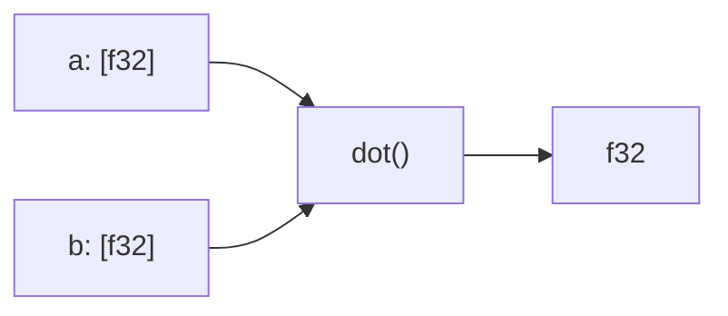

<p align="center"><b>innr</b></p>



SIMD-accelerated vector similarity primitives.

Dual-licensed under MIT or Apache-2.0.

```rust
use innr::{dot, cosine, norm};

let a = [1.0_f32, 0.0, 0.0];
let b = [0.707, 0.707, 0.0];

let d = dot(&a, &b);      // 0.707
let c = cosine(&a, &b);   // 0.707
let n = norm(&a);         // 1.0
```

## Operations

| Function | Description |
|----------|-------------|
| `dot` | Inner product |
| `norm` | L2 norm |
| `cosine` | Cosine similarity |
| `l2_distance` | Euclidean distance |
| `sparse_dot` | Sparse vector dot (`sparse` feature) |
| `maxsim` | ColBERT late interaction (`maxsim` feature) |

## SIMD Dispatch

| Architecture | Instructions | Detection |
|--------------|--------------|-----------|
| x86_64 | AVX2 + FMA | Runtime |
| aarch64 | NEON | Always |
| Other | Portable | LLVM auto-vec |

Vectors < 16 dimensions use portable code.

## Features

- `sparse` — sparse vector operations
- `maxsim` — ColBERT late interaction scoring
- `full` — all features

## Performance

For maximum performance, build with native CPU features:

```bash
RUSTFLAGS="-C target-cpu=native" cargo build --release
```

Or specify a portable baseline with SIMD:

```bash
# AVX2 (89% of x86_64 CPUs)
RUSTFLAGS="-C target-cpu=x86-64-v3" cargo build --release

# SSE2 only (100% compatible)
RUSTFLAGS="-C target-cpu=x86-64" cargo build --release
```

Run benchmarks:

```bash
cargo bench
```

Generate flamegraphs (requires `cargo-flamegraph`):

```bash
./scripts/profile.sh dense
```
