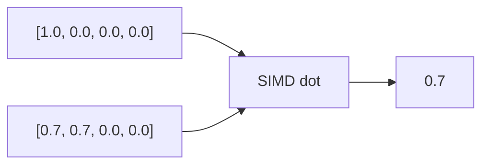

<p align="center"><b>innr</b></p>



SIMD-accelerated vector similarity primitives.

MIT OR Apache-2.0

```rust
use innr::{dot, cosine, norm};

let a = [1.0_f32, 0.0, 0.0];
let b = [0.707, 0.707, 0.0];

let d = dot(&a, &b);      // 0.707
let c = cosine(&a, &b);   // 0.707
let n = norm(&a);         // 1.0
```

## Operations

| Function | Description |
|----------|-------------|
| `dot` | Inner product |
| `norm` | L2 norm |
| `cosine` | Cosine similarity |
| `l2_distance` | Euclidean distance |
| `sparse_dot` | Sparse vector dot (feature `sparse`) |
| `maxsim` | ColBERT late interaction (feature `maxsim`) |

## SIMD Dispatch

| Architecture | Instructions | Detection |
|--------------|--------------|-----------|
| x86_64 | AVX-512 | Runtime |
| x86_64 | AVX2+FMA | Runtime |
| aarch64 | NEON | Always |
| Other | Portable | LLVM auto-vec |

## Features

- `sparse` — sparse vector operations
- `maxsim` — ColBERT late interaction scoring
- `full` — all features
