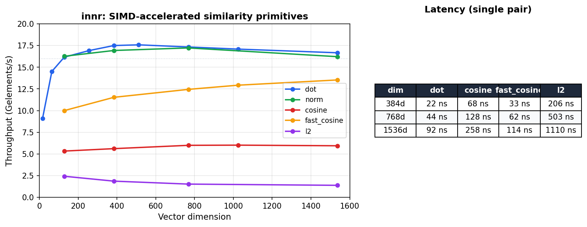

# innr

[](https://crates.io/crates/innr)
[](https://docs.rs/innr)
[](https://github.com/arclabs561/innr/actions/workflows/ci.yml)

SIMD-accelerated vector similarity primitives.

## Quickstart

```toml
[dependencies]
innr = "0.2"
```

```rust
use innr::{dot, cosine, norm};

let a = [1.0_f32, 0.0, 0.0];
let b = [0.707, 0.707, 0.0];

let d = dot(&a, &b);      // 0.707
let c = cosine(&a, &b);   // 0.707
let n = norm(&a);         // 1.0
```

### Batch search

```rust
use innr::batch::{VerticalBatch, batch_knn_dot};

// 4 vectors of dimension 3
let corpus = vec![
    vec![1.0f32, 0.0, 0.0],
    vec![0.0, 1.0, 0.0],
    vec![0.7, 0.7, 0.0],
    vec![0.0, 0.0, 1.0],
];
let batch = VerticalBatch::from_rows(&corpus);

let query = [0.8f32, 0.6, 0.0];
let result = batch_knn_dot(&query, &batch, 2);
// result.indices: top-2 nearest by dot product
// result.scores: corresponding similarity scores
```

## Operations

**Core**: `dot`, `cosine`, `norm`, `l2_distance`, `l2_distance_squared`, `l1_distance`, `angular_distance`, `normalize`. Portable fallbacks in `innr::dense` (e.g. `dot_portable`).

**Matryoshka**: `matryoshka_dot`, `matryoshka_cosine` -- similarity on a prefix of the embedding.

**Binary quantization (1-bit)**: `encode_binary` to packed bits, `binary_dot`, `binary_hamming`, `binary_jaccard`. 32x memory reduction over f32.

**Ternary quantization (1.58-bit)**: `ternary::encode_ternary` to {-1, 0, +1}, `ternary_dot`, `ternary_hamming`, `asymmetric_dot` (float query x ternary doc). 16-20x compression.

**Scalar quantization (uint8)**: `scalar::QuantizationParams` (from `fit()`, `fit_quantile()`, or `from_range()`), `quantize_u8`, `asymmetric_dot_u8`. Precomputed query path via `query_context()` + `asymmetric_dot_u8_precomputed`. Batch search via `batch_knn_u8`. 4x compression.

**Fast approximate math**: `fast_cosine_dispatch` (SIMD-dispatched), `fast_cosine` (portable Quake III), `fast_rsqrt`, `fast_rsqrt_precise`.

**Batch operations**: `batch::VerticalBatch` (PDX-style columnar layout) with `batch_dot`, `batch_l2_squared`, `batch_l2_squared_pruning`, `batch_cosine`, `batch_norms`, `batch_knn`, `batch_knn_cosine`, `batch_knn_dot`, `batch_knn_filtered` (predicate pushdown), `batch_knn_reordered` (variance-ordered pruning), `batch_knn_adaptive` (approximate early-exit), `batch_dimension_variance`.

**Sparse vectors**: `sparse_dot`.

**Late interaction**: `maxsim`, `maxsim_cosine` (ColBERT-style), `sparse_maxsim` (sparse late interaction).

## SIMD Dispatch

| Architecture | Instructions | Detection |
|--------------|--------------|-----------|
| x86_64 | AVX-512F | Runtime |
| x86_64 | AVX2 + FMA | Runtime |
| aarch64 | NEON | Always |
| Other | Portable | LLVM auto-vec |

Vectors < 16 dimensions use portable code.

## Performance



*Apple Silicon (NEON). Run `cargo bench` to reproduce on your hardware.*

For maximum performance, build with native CPU features:

```bash
RUSTFLAGS="-C target-cpu=native" cargo build --release
```

Run benchmarks:

```bash
cargo bench
```

## Examples

[**01_basic_ops.rs**](examples/01_basic_ops.rs) -- Core similarity metrics and their mathematical relationships. Proves `L2^2(a,b) = 2(1 - cosine(a,b))` for normalized vectors.

[**batch_demo.rs**](examples/batch_demo.rs) -- PDX-style columnar layout for batch retrieval. Transposes 10K vectors (128d), runs 100 queries, verifies k-NN against brute-force.

[**binary_demo.rs**](examples/binary_demo.rs) -- Binary quantization for first-stage retrieval. 32x memory reduction, measures recall@10 against full-precision search.

See `examples/` for more: `fast_math_demo`, `matryoshka_search`, `maxsim_colbert`, `ternary_demo`.

## Tests

```bash
cargo test -p innr
```

## License

Dual-licensed under MIT or Apache-2.0.
